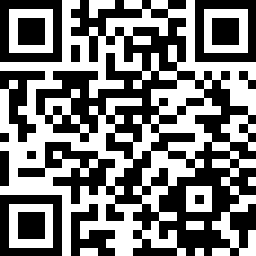



## This is a PowerShell module for interacting with VeeamPN appliance

This module allows you to add new endpoint clients to VeeamPN, download a configuration file, install and configure OpenVPN.
This module can be easily installed from the [PowerShellGallery](https://www.powershellgallery.com/packages/VeeamPN)

> `Install-Module 'VeeamPN'`

See [VeeamPN_Functions](VeeamPN_Functions.md) for a list of commands available in this module.

Checkout the [Examples](https://github.com/christaylorcodes/VeeamPN/tree/master/Examples) folder for ways to use the module.

## [Contributing](CONTRIBUTING.md)

If you use this project please give it a star and follow so you can get updated when new features are released. This also lets me know what projects are getting used and what ones I should dedicate more time to. If you want to get more involved please see the [contributing page](CONTRIBUTING.md). Projects need all kinds of help even if you don't know how to code.

Want to share something you created using the module? Submit it to be featured as a Community Package.

## [Donating](https://paypal.me/ChrisTaylorCodes)

If you cant take time to contribute maybe you would like to help in other ways.

It takes time to maintain this project. Does the time spent on this module help you do cool things? Is that time worth a beer or two?

[Donations](https://paypal.me/ChrisTaylorCodes) allow me to spend more time on this project and implement your feature requests.

| BTC                                                                                                          | ETH                                                                                                          |
| ------------------------------------------------------------------------------------------------------------ | ------------------------------------------------------------------------------------------------------------ |
|  |  |
| `bc1qtfghmwqa6tshkpf03nsjlf40a6vahwg2n4vvqv`                                                                 | `0x4aDC4F156D0A285ac9FB8C9Bd1513fe64FE35F1B`                                                                 |
